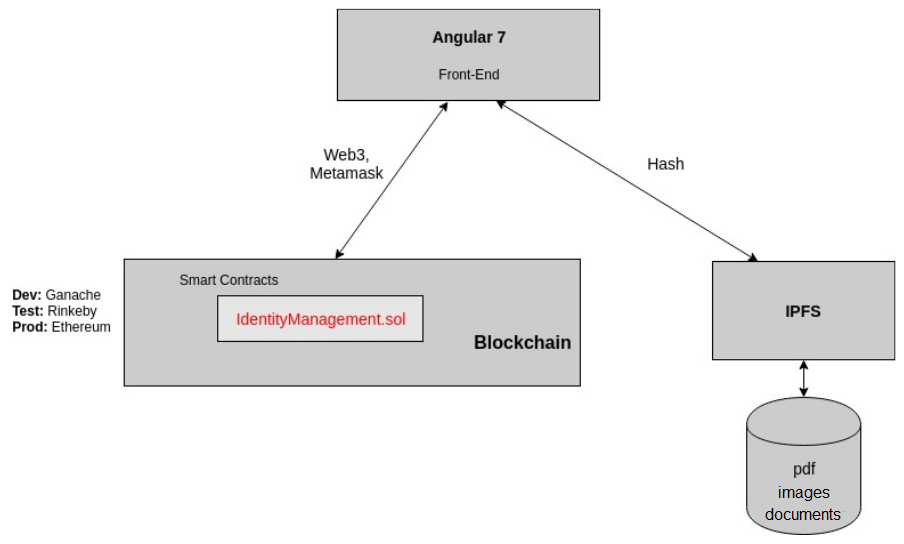
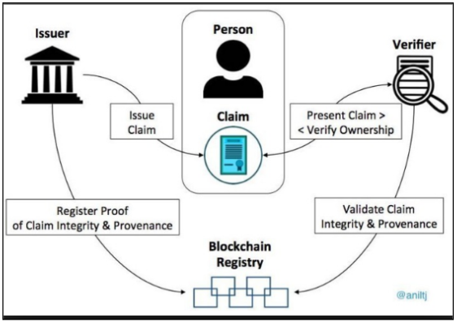
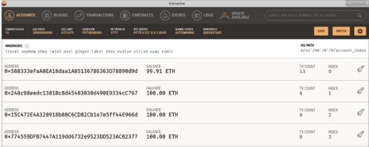
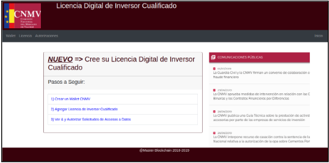
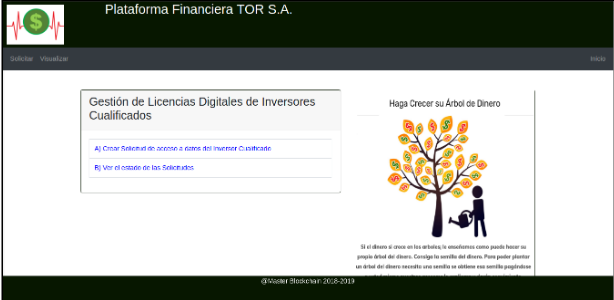

Good Self Sovereign Identity Example found at:
https://github.com/danielmirdem/dapp-self-sovereign-identity

Archived for eventual reference and studying purposes.

# Self Sovereign Identity / Identidad Digital Soberana

----------------------------------------------------------------------------------------------

# Architecture Diagram

# Claims Scheme

# Technologies:

- Angular 7
- Node v8.10.0
- Truffle v5.0.21 (core: 5.0.21)
- Solidity v0.5.0 (solc-js)
- Web3.js v1.0.0-beta.37
- Ganache v2.0.1
- Metamask 6.7.2
- IPFS Client 0.36.4
- Git 2.17.1

# Getting Started

1) Download the project:
https://github.com/danielmirdem/identidad-digital-soberana

2) Run Ganache:
https://www.trufflesuite.com/ganache

3) Connect Metamask to Ganache:
https://www.youtube.com/watch?v=jNQLnq8aNuA

4) Deploy the smart-contract using Truffle:

    $ truffle deploy

5) Run in project_name/app/identity folder:

    $ ng serve

6) Test the Demo:

http://localhost:4200/

http://localhost:4200/inicio/2

----------------------------------------------------------------------------------------------